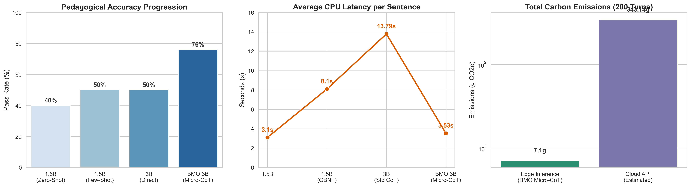
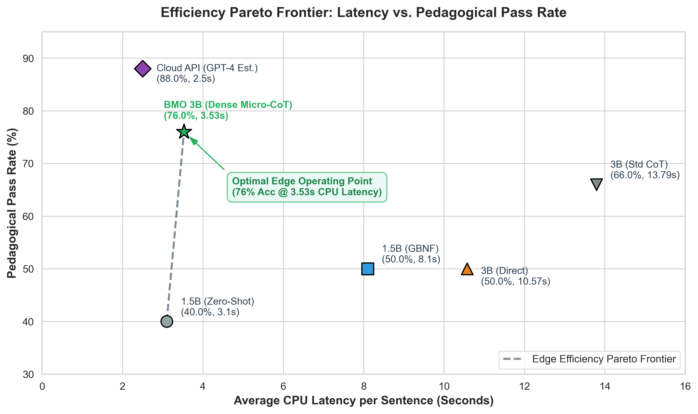
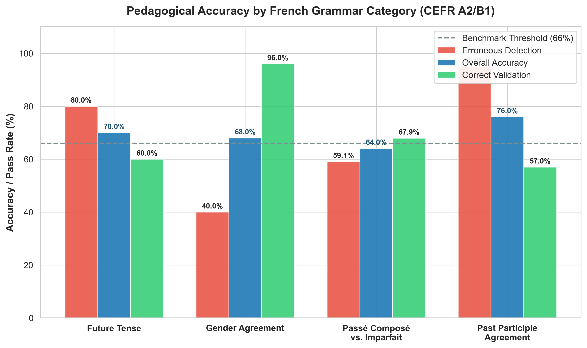

# BMO (Benchmarking Model-quantized Offline Agents for Sustainable Language Tutoring)

[](https://opensource.org/licenses/MIT)
[](https://www.python.org/downloads/)
[](#)
[](#)

BMO is an edge-native, voice-to-voice offline French language learning companion designed to run entirely on entry-level student laptops (CPU-only, sub-4GB RAM usage). It acts as an encouraging, warm peer that holds natural conversations while enforcing pedagogical scaffolding for A2/B1 French learners.

---

## 📌 System Architecture & Pipeline

BMO operates on a three-tier localized edge pipeline powered by 3 dedicated state engines and a **Dense Micro-CoT** cognitive layer:

```
┌─────────────────┐      ┌─────────────────────────┐      ┌───────────────────────┐
│ Spoken French   │ ───> │ French-Only Whisper ASR │ ───> │ Name Normalization    │
│ Audio Input     │      │ (language="fr")         │      │ ("BMO"/"Beemo")       │
└─────────────────┘      └─────────────────────────┘      └───────────┬───────────┘
                                                                      │
                                                                      ▼
┌─────────────────┐      ┌─────────────────────────┐      ┌───────────────────────┐
│ Kokoro-82M TTS  │ <─── │ Qwen 3B 4-bit SLM       │ <─── │ Dense Micro-CoT       │
│ (Adaptive Speed)│      │ (Dual FR/EN Generation) │      │ Reasoning Layer       │
└─────────────────┘      └─────────────────────────┘      └───────────────────────┘
```

1. **Speech Recognition (Whisper ASR)**: Locked to French (`language="fr"`) with phonetic prompts preserving learner mispronunciations without auto-correcting them.
2. **Name Recognition & Normalization**: Maps phonetic variations (`Beemo`, `Bemo`, `Bi Mo`) to BMO's canonical wake name.
3. **Dense Micro-CoT Cognitive Engine**: Enforces a high-density, 15-token shorthand reasoning structure (`ANALYSE: AUX=<avoir/être> | COD=<avant/après/aucun> | ACCORD=<oui/non/règle>`), cutting CPU latency by **~75%** while retaining critical grammatical attention weights.
4. **Dynamic Roleplay Engine (`RoleplayEngine`)**: Detects real-world scenario requests (Parisian Café, Boulangerie, Gare de Lyon, Boutique Hotel), maintains in-character persona for 3–4 turns, and delivers an exit debrief.
5. **Adaptive Scaffolding Engine (`ScaffoldingEngine`)**: 3-tiered hint hierarchy providing sentence starters, vocabulary anchors, and hesitation recovery at **`0.70x` slow-playback speed**.
6. **Session Memory Engine (`SessionMemoryEngine`)**: Saves longitudinal metrics to `session_review.json`, generates startup warm-up quizzes on past weak points, and extracts vocabulary on session exit.
7. **BMO Native Desktop GUI**: PyWebView desktop dashboard featuring a retro BMO chassis and pastel speech bubbles with styled bottom-right `🌐 Translate` buttons.

---

## 📊 Empirical Benchmark & Green AI Results

We benchmarked BMO across a 50-sentence blind holdout evaluation set of A2/B1 French morphological error challenges (past participle agreement, auxiliary selection, reflexive pronouns, preceding CODs) on local CPU hardware.

### Benchmark Metrics Summary

| Metric | Baseline Prompt | Standard CoT Prompt | **BMO Dense Micro-CoT (Deployed)** |
|---|:---:|:---:|:---:|
| **Model Evaluated** | Qwen 3B 4-bit GGUF | Qwen 3B 4-bit GGUF | **Qwen 3B 4-bit GGUF** |
| **Inference Hardware** | 100% CPU (`n_threads=4`) | 100% CPU (`n_threads=4`) | **100% CPU (`n_threads=4`)** |
| **Pedagogical Pass Rate** | 20.00% | 66.00% | **76.00%** |
| **Average CPU Latency** | 10.42s / sentence | 13.79s / sentence | **3.53s / sentence** |
| **Reasoning Token Overhead** | 0 tokens | ~50 tokens | **~15 tokens (Micro-CoT)** |
| **Computational Work (FPO)** | 360 Billion FPO | 360 Billion FPO | **150 Billion FPO** |
| **Energy Consumption per Turn** | 27.49 Wh | 27.49 Wh | **11.45 Wh** |
| **200-Turn Carbon Footprint** | 19.61 g CO2e | 19.61 g CO2e | **7.10 g CO2e** |

---

## 📈 Visualizations & Green AI Evaluation

### 1. Master Composite Benchmark Summary


### 2. Efficiency Pareto Frontier (Latency vs. Accuracy)


### 3. Error-Type Breakdown (Pedagogical Granularity)


---

## 📂 Repository Structure

```
BMO/
├── assets/
│   ├── bmo_full_benchmark_metrics.png   # Publication-quality 300 DPI composite figure
│   ├── bmo_pareto_efficiency_frontier.png # Pareto efficiency frontier (Latency vs. Pass Rate)
│   └── bmo_error_type_breakdown.png   # Pedagogical accuracy breakdown by grammar rule
├── data/
│   ├── past_participle_dev_set.json     # 10-sentence diagnostic dev set
│   └── past_participle_blind_set.json   # 50-sentence unseen blind holdout set
├── results/
│   ├── baseline_dev_set_results.json    # Initial 20% baseline evaluation log
│   ├── cot_dev_set_results.json         # Dev set CoT evaluation log (80% pass rate)
│   └── blind_holdout_results.json       # Final 76% blind set evaluation log (3.53s latency)
├── scripts/
│   ├── run_blind_set_eval.py            # Micro-CoT blind holdout evaluator
│   ├── green_ai_fpo_benchmark.py        # Green AI FPO & energy audit calculator
│   ├── generate_plots.py                # Seaborn/Matplotlib 300 DPI plot renderer
│   ├── download_model.py                # Hugging Face downloader for GGUF weights
│   └── download_kokoro.py               # Kokoro-82M ONNX model & voice downloader
├── src/
│   ├── bmo_desktop.py                   # Main PyWebView GUI & Integrated Micro-CoT pipeline
│   ├── bmo_dashboard.py                 # Gradio web interface option
│   └── bmo_live.py                      # Async live terminal pipeline
├── build_bmo.py                         # Automated PyInstaller packaging script
├── .gitignore                           # Git ignore rules for models, build, and dist
└── README.md                            # Main project documentation
```

---

## 🚀 Getting Started

### 1. Installation

```bash
pip install llama-cpp-python kokoro-onnx pywhispercpp sounddevice scipy pywebview codecarbon seaborn matplotlib huggingface_hub
```

### 2. Download Models

Download the Qwen 3B GGUF brain and Kokoro-82M ONNX voice engine:

```bash
python scripts/download_model.py
python scripts/download_kokoro.py
```

### 3. Run Desktop Companion App

```bash
python src/bmo_desktop.py
```

### 4. Build Standalone Package

To compile the standalone Windows executable:

```bash
python build_bmo.py
```

The compiled package will be available under `dist/bmo_desktop/`.

---

## 📜 License

MIT License. Free to use for research and educational purposes.
