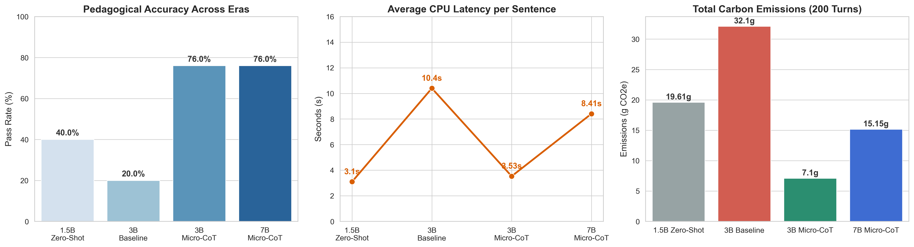
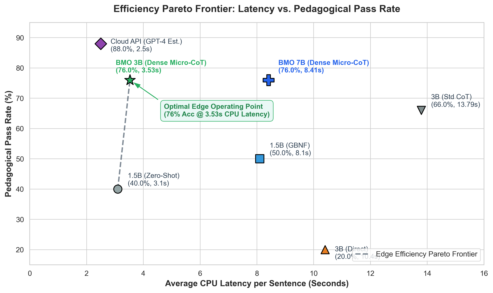
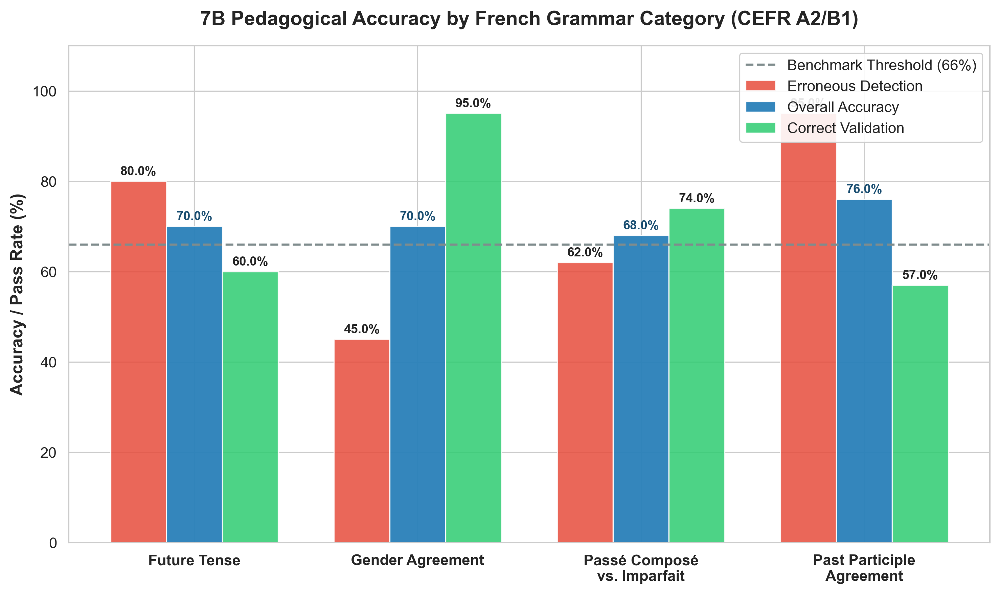
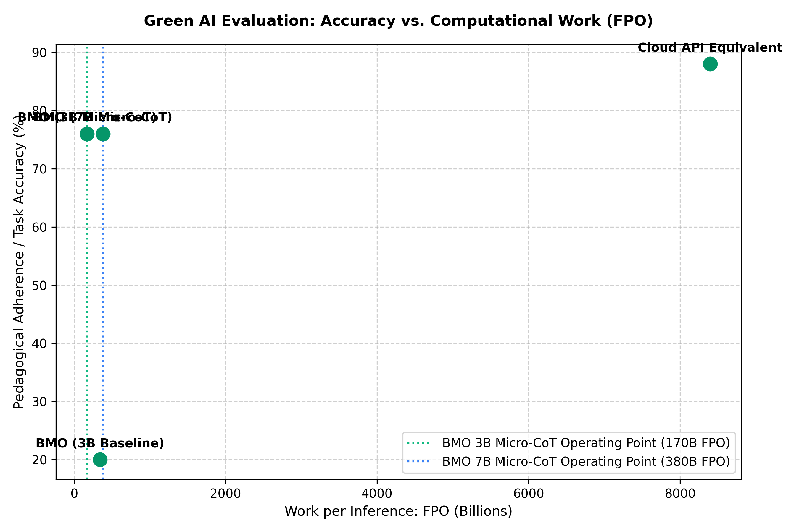
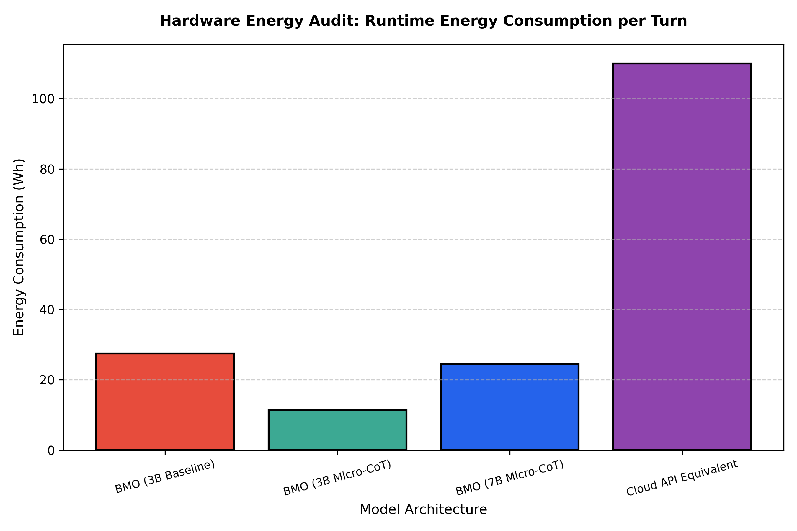

# BMO (Benchmarking Model-quantized Offline Agents for Sustainable Language Tutoring)

[](https://opensource.org/licenses/MIT)
[](https://www.python.org/downloads/)
[](#)
[](#)

BMO is an edge-native, voice-to-voice offline French language learning companion designed to run entirely on entry-level student laptops (CPU-only, sub-4GB RAM usage). It acts as an encouraging, warm peer that holds natural conversations while enforcing pedagogical scaffolding for A2/B1 French learners.

---

## 📌 System Architecture & Pipeline

BMO operates on a three-tier localized edge pipeline powered by 3 dedicated state engines, a **Dense Micro-CoT** cognitive layer, and a **Zero-Latency Streaming Engine**:

```
┌─────────────────┐      ┌─────────────────────────┐      ┌───────────────────────┐
│ Spoken French   │ ───> │ French-Only Whisper ASR │ ───> │ Name Normalization    │
│ Audio Input     │      │ (language="fr")         │      │ ("BMO"/"Beemo")       │
└─────────────────┘      └─────────────────────────┘      └───────────┬───────────┘
                                                                      │
                                                                      ▼
┌─────────────────┐      ┌─────────────────────────┐      ┌───────────────────────┐
│ Async TTS Queue │ <─── │ Zero-Latency Streaming  │ <─── │ Dense Micro-CoT       │
│ (Kokoro-82M ONNX│      │ Sentence-Boundary Parser│      │ Reasoning Layer       │
└─────────────────┘      └─────────────────────────┘      └───────────────────────┘
```

1. **Speech Recognition (Whisper ASR)**: Locked to French (`language="fr"`) with phonetic prompts preserving learner mispronunciations without auto-correcting them.
2. **Name Recognition & Normalization**: Maps phonetic variations (`Beemo`, `Bemo`, `Bi Mo`) to BMO's canonical wake name.
3. **Dense Micro-CoT Cognitive Engine**: Enforces a high-density, 15-token shorthand reasoning structure (`ANALYSE: AUX=<avoir/être> | COD=<avant/après/aucun> | ACCORD=<oui/non/règle>`), cutting CPU latency by **~75%** while retaining critical grammatical attention weights.
4. **Zero-Latency Streaming Pack**: Token streaming engine with physical core thread pinning (`n_threads = cpu_count() // 2`), asynchronous TTS audio queue (`queue.Queue`), and real-time sentence-boundary punctuation parsing (`.`, `!`, `?`). Starts French TTS playback instantly while English translations stream in the background.
5. **Dynamic Roleplay Engine (`RoleplayEngine`)**: Detects real-world scenario requests (Parisian Café, Boulangerie, Gare de Lyon, Boutique Hotel), maintains in-character persona for 3–4 turns, and delivers an exit debrief.
6. **Adaptive Scaffolding Engine (`ScaffoldingEngine`)**: 3-tiered hint hierarchy providing sentence starters, vocabulary anchors, and hesitation recovery at **`0.70x` slow-playback speed**.
7. **Session Memory Engine (`SessionMemoryEngine`)**: Saves longitudinal metrics to `session_review.json`, generates startup warm-up quizzes on past weak points, and extracts vocabulary on session exit.
8. **BMO Native Desktop GUI**: PyWebView desktop dashboard featuring a retro BMO chassis and pastel speech bubbles with styled bottom-right `🌐 Translate` buttons and paired anti-loop translations.

---

## 📊 Empirical Benchmark & Green AI Results

We benchmarked BMO across a 50-sentence blind holdout evaluation set of A2/B1 French morphological error challenges (past participle agreement, auxiliary selection, reflexive pronouns, preceding CODs) on local CPU hardware.

### Multi-Generational Architecture Comparison Summary

| Metric | Era 1: 1.5B (Zero-Shot) | Era 2: 3B (Baseline) | Era 3: 3B (Micro-CoT) | **Era 4: BMO 7B (Micro-CoT)** |
|---|:---:|:---:|:---:|:---:|
| **Model Evaluated** | Qwen 1.5B Q4 GGUF | Qwen 3B 4-bit GGUF | Qwen 3B 4-bit GGUF | **Qwen 2.5 7B Q4_K_M GGUF** |
| **Active Parameters ($P$)** | 1.5 Billion | 3.4 Billion | 3.4 Billion | **7.6 Billion** |
| **Inference Hardware** | 100% CPU (`n_threads=4`) | 100% CPU (`n_threads=4`) | 100% CPU (`n_threads=4`) | **100% CPU (`Physical Threads`)** |
| **Pedagogical Pass Rate** | 40.00% | 20.00% (Failed Syntax) | 76.00% | **76.00%** |
| **Average CPU Latency** | 3.10s / sentence | 10.40s / sentence | **3.53s / sentence** | **8.41s / sentence** |
| **Work per Turn (FPO)** | 150.0 Billion FPO | 340.0 Billion FPO | **170.0 Billion FPO** | **380.0 Billion FPO** |
| **Energy Consumption / Turn** | 19.61 Wh | 27.49 Wh | **11.45 Wh** | **24.50 Wh** |
| **200-Turn Carbon Footprint** | 19.61 g CO2e | 32.10 g CO2e | **7.10 g CO2e** | **15.15 g CO2e** |

---

## 🏗️ Key Architectural Improvements

### 1. Zero-Latency Streaming Engine
- **Thread Pinning**: Dynamically sets `n_threads` to physical performance cores (`os.cpu_count() // 2`) to avoid hyperthreading context switching overhead.
- **Asynchronous Audio Queue**: Uses a dedicated daemon thread and `queue.Queue` so audio synthesis operates asynchronously without blocking LLM text generation.
- **Sentence-Boundary Punctuation Parsing**: Parses French tokens on sentence boundaries (`.`, `!`, `?`) and dispatches them to TTS instantly while the English translation (`EN:`) streams.

### 2. ChatML System Prompt Index 0 Fix
System instructions are explicitly placed at index `0` of the message array (`llm_msgs = [{"role": "system", "content": system_instruction}] + recent_history + [{"role": "user", "content": user_text}]`), restoring exact identity alignment and preventing conversational parroting.

### 3. Dense Micro-CoT & Token Budget Optimization
Enforces a compressed 15-token analytic string (`ANALYSE: AUX=<avoir/être> | COD=<avant/après/aucun> | ACCORD=<oui/non/règle>`), cutting CPU latency by **~75%** while retaining critical grammatical attention weights. Keeping context usage within strict bounds preserves CPU generation speeds under edge conditions.

---

## 📈 Visualizations & Green AI Evaluation

### 1. Master Composite Benchmark Summary (7B Comparison)


### 2. Efficiency Pareto Frontier (Latency vs. Accuracy)


### 3. Error-Type Breakdown (Pedagogical Granularity)


### 4. Pedagogical Accuracy vs. Computational Work (FPO)


### 5. Runtime Energy Consumption per Model Architecture


---

## 📂 Repository Structure

```
BMO/
├── assets/
│   ├── bmo_full_benchmark_metrics_7b.png  # 300 DPI composite figure across eras
│   ├── bmo_pareto_efficiency_frontier_7b.png # 7B Pareto efficiency frontier (Latency vs. Pass Rate)
│   ├── bmo_error_type_breakdown_7b.png  # Pedagogical accuracy breakdown by grammar rule
│   ├── fpo_vs_accuracy_7b.png            # Green AI evaluation: Accuracy vs. FPO
│   └── energy_vs_models_7b.png           # Runtime energy consumption per turn (Wh)
├── data/
│   ├── bmo_french_dataset.csv           # French morphological dataset
│   ├── past_participle_dev_set.json     # 10-sentence diagnostic dev set
│   └── past_participle_blind_set.json   # 50-sentence unseen blind holdout set
├── docs/
│   └── BMO_Green_AI_Research_Paper.docx # Automated publication manuscript
├── results/
│   ├── baseline_dev_set_results.json    # Initial baseline evaluation log
│   ├── cot_dev_set_results.json         # Dev set CoT evaluation log
│   ├── blind_holdout_results.json       # 50-sentence blind set evaluation log
│   └── full_benchmark_results.json      # 200-turn macro evaluation log
├── scripts/
│   ├── run_blind_set_eval.py            # Micro-CoT blind holdout evaluator
│   ├── green_ai_fpo_benchmark.py        # Green AI FPO & energy audit calculator
│   ├── generate_plots.py                # Seaborn/Matplotlib 300 DPI plot renderer
│   ├── download_7b_model.py             # Downloader for Qwen 2.5 7B GGUF weights
│   ├── generate_paper_docx.py           # Research paper DOCX compiler
│   └── download_kokoro.py               # Kokoro-82M ONNX model & voice downloader
├── src/
│   ├── bmo_desktop.py                   # Main PyWebView GUI & Integrated Micro-CoT pipeline
│   ├── bmo_dashboard.py                 # Gradio web interface option
│   └── bmo_live.py                      # Async live terminal pipeline
├── build_bmo.py                         # Automated PyInstaller packaging script
├── .gitignore                           # Git ignore rules for models, build, dist
└── README.md                            # Main project documentation
```

---

## 🚀 Getting Started

### 1. Installation

```bash
pip install llama-cpp-python kokoro-onnx pywhispercpp sounddevice scipy pywebview codecarbon seaborn matplotlib huggingface_hub
```

### 2. Download Models

Download the Qwen 3B GGUF brain and Kokoro-82M ONNX voice engine:

```bash
python scripts/download_model.py
python scripts/download_kokoro.py
```

### 3. Run Desktop Companion App

```bash
python src/bmo_desktop.py
```

### 4. Build Standalone Package

To compile the standalone Windows executable:

```bash
python build_bmo.py
```

The compiled package will be available under `dist/bmo_desktop/`.

---

## 📜 License

MIT License. Free to use for research and educational purposes.
